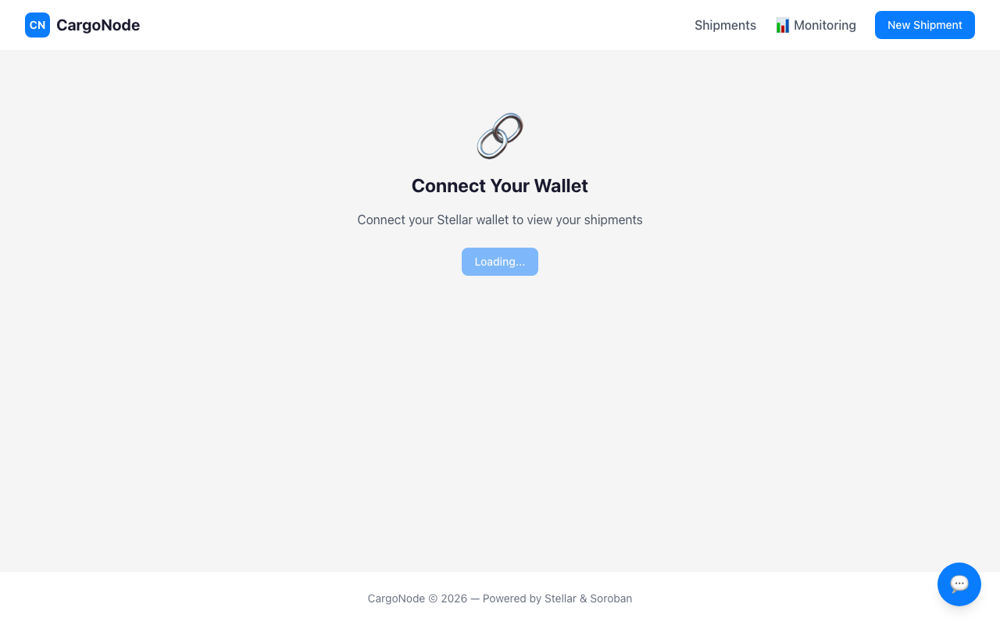
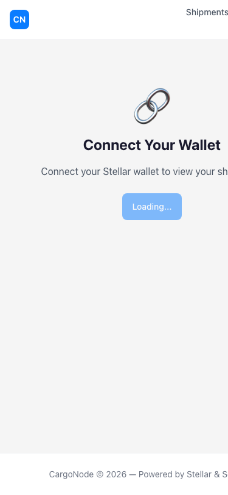
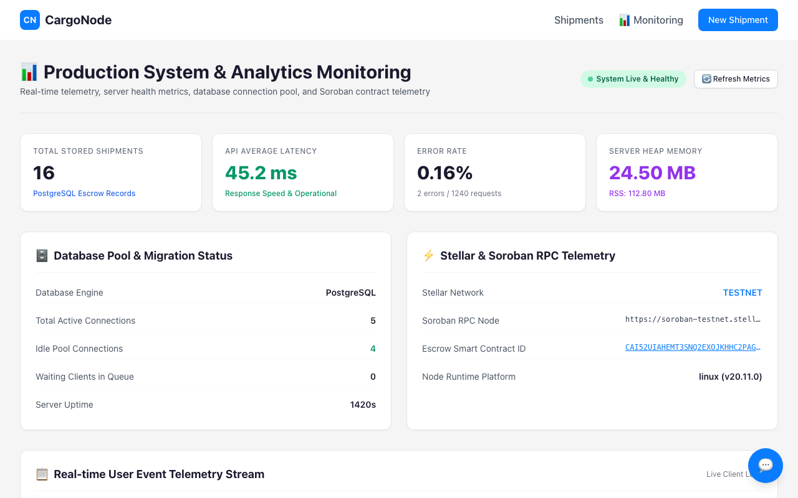

# CargoNode

Smart escrow payments for freight logistics, powered by Stellar and Soroban.

> **Decentralized logistics payment platform** — Lock shipment payments in a Soroban smart contract. Drivers get paid instantly upon delivery confirmation. No intermediaries.

## Live Demo

- **Frontend**: [cargonode.vercel.app](https://cargonode.vercel.app) (testnet)
- **Contract**: [`CAI52UIAHEMT3SNQ2EXOJKHHC2PAGLGURZYNL6HFZJ6LL5KDQFURBQUH`](https://stellar.expert/testnet/contract/CAI52UIAHEMT3SNQ2EXOJKHHC2PAGLGURZYNL6HFZJ6LL5KDQFURBQUH)

## Level 4 Submission Proofs

- 👥 **10+ User Wallet Interactions Proof**: [PROOF_OF_USERS.md](PROOF_OF_USERS.md)
- 💬 **User Feedback Summary**: [FEEDBACK_SUMMARY.md](FEEDBACK_SUMMARY.md)
- 📊 **Monitoring & Analytics**: Pino structured backend logging + [analytics.ts](frontend/src/lib/analytics.ts)
- 🎥 **Demo Video Link**: *Include live video URL here upon submission*

### Product Screenshots

#### 1. Main Product UI Dashboard


#### 2. Mobile Responsive Design


#### 3. Real-Time Telemetry & Monitoring Setup


## Architecture

```
CargoNode/
├── contracts/                    # Soroban smart contracts (Rust)
│   ├── cargonode_escrow/        # Escrow contract (create, accept, confirm, cancel)
│   └── test_token/              # Test SEP-41 token for development
├── backend/                      # Node.js API (Express + PostgreSQL)
│   └── src/
│       ├── routes/shipments.ts  # REST API endpoints
│       ├── lib/stellar.ts       # Stellar SDK helpers
│       └── db/                  # Database pool + migrations
└── frontend/                     # Next.js dashboard (React + Tailwind)
    └── src/
        ├── app/                 # App Router pages
        ├── components/          # Reusable UI components
        ├── hooks/               # Freighter wallet hook
        └── lib/                 # API client + Stellar config
```

## How It Works

1. **Shipper** creates a shipment → USDC locked in Soroban escrow contract
2. **Driver** accepts the shipment and picks up cargo
3. Cargo is delivered
4. **Shipper** confirms delivery
5. Smart contract **automatically releases** USDC to driver's wallet

## Quick Start

### Prerequisites

- Rust + `stellar-cli`
- Node.js 20+
- PostgreSQL

### 1. Deploy Smart Contract

```bash
cd contracts
stellar contract build
stellar keys generate deployer --network testnet --fund
stellar contract deploy \
  --wasm target/wasm32v1-none/release/cargonode_escrow.wasm \
  --source-account deployer \
  --network testnet \
  -- \
  --deployer <DEPLOYER_ADDRESS> \
  --token-address <USDC_CONTRACT_ADDRESS>
```

### 2. Setup Backend

```bash
cd backend
cp .env.example .env
# Edit .env with your values
npm install
npm run db:migrate
npm run dev
```

### 3. Setup Frontend

```bash
cd frontend
cp .env.example .env.local
# Edit .env.local with your values
npm install
npm run dev
```

## API Reference

### Endpoints

| Method | Path | Description |
|--------|------|-------------|
| `GET` | `/api/health` | Health check |
| `GET` | `/api/shipments` | List shipments (query: `address`, `role`) |
| `GET` | `/api/shipments/:id` | Get shipment details |
| `POST` | `/api/shipments` | Create shipment |
| `POST` | `/api/shipments/:id/submit` | Submit signed transaction |
| `POST` | `/api/shipments/:id/accept` | Build accept transaction |
| `POST` | `/api/shipments/:id/confirm` | Build confirm transaction |
| `POST` | `/api/shipments/:id/cancel` | Build cancel transaction |
| `GET` | `/api/shipments/:id/onchain` | Read on-chain shipment data |

### Request/Response Examples

**Create Shipment**
```json
POST /api/shipments
{
  "shipper_address": "GC2YSDUF...",
  "driver_address": "GAW5QO2J...",
  "amount": "100.00",
  "origin": "Mumbai",
  "destination": "Delhi",
  "cargo_description": "Electronics",
  "cargo_weight_kg": 500
}
```

## Tech Stack

- **Blockchain**: Stellar + Soroban Smart Contracts
- **Token**: USDC (SEP-41 Stellar Asset Contract)
- **Backend**: Node.js, Express, PostgreSQL
- **Frontend**: Next.js, React, Tailwind CSS
- **Wallet**: Freighter (browser extension)
- **Monitoring**: Pino structured logging

## Deployment

### Frontend (Vercel)

1. Push to GitHub
2. Import in Vercel
3. Set environment variables
4. Deploy

### Backend (Railway)

1. Push to GitHub
2. Import in Railway
3. Set environment variables (see `.env.example`)
4. Deploy

## Smart Contract Details

| Property | Value |
|----------|-------|
| Contract ID | `CAI52UIAHEMT3SNQ2EXOJKHHC2PAGLGURZYNL6HFZJ6LL5KDQFURBQUH` |
| Network | Stellar Testnet |
| Token | `CAATNNYENLGM6JUS522SLKU2BYHHLN5PYI7XNRJXP7CE2KESE7P52FW5` |
| Functions | `create_shipment`, `accept_shipment`, `confirm_delivery`, `cancel_shipment`, `get_shipment` |

## Security

- Payments locked in Soroban smart contracts (no intermediary)
- Auth checks on every state transition
- Rate limiting on all API endpoints
- Zod validation on all inputs
- Parameterized SQL queries (no injection)
- XDR verification before submission

## Contributing

1. Fork the repository
2. Create a feature branch
3. Commit your changes
4. Push to the branch
5. Create a Pull Request

## License

MIT
